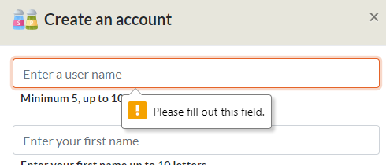
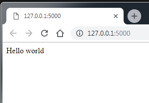
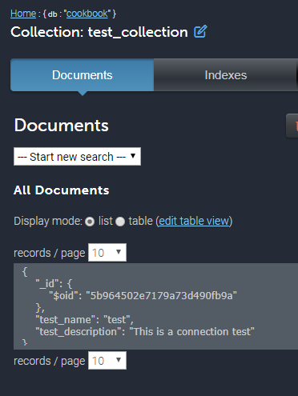
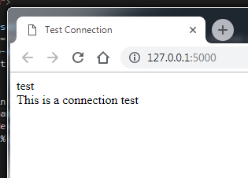
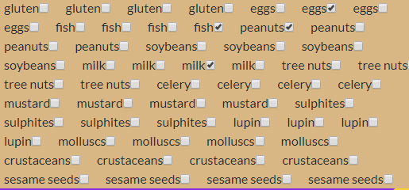

<a id="topofpage"></a>
#   Testing The CookBook Application

Return to main ReadMe file [ReadMe](README.md)
### Table of Contents

*   [Testing](#testing)
    *   [During development](#during)
    *   [Development/Defensive Design Testing](#devtesting)
*   [Testing](#initial)
    *   [Test: vscode and flask](#initest)
    *   [Test: database connection](#dbtest)
    *   [Test: To ensure our site works on Heroku](#heroku)
    *   [Test: Sign up](#sign)
    *   [Test: Login Form](#log)
    *   [Test: Logout](#logout)
    *   [Test: My recipes page](#my)
    *   [Test: Edit Recipe](#edit)
    *   [Test: My Recipes Voting](#vote)
    *   [Test: Statistics](#stat)
    *   [Test: Creating Statistic charts](#statsc)
*   [Ongoing Testing](#ongoing)
*   [User Testing](#usability)
*   [Final Testing](#final)

<a id="testing"></a>

#   Testing

The app was tested on an ongoing basis. Chrome and Chrome Developer Tools were the primary browser and tool used for testing. However, the site was also tested using Firefox and Internet Explorer.

*	CSS passed validation using the CSS Validation Service provided by The World Wide Web Consortium (W3C): https://jigsaw.w3.org/css-validator/
*	There were no pep8 styling issues 
*	PyLint was also installed and used
*	All the functions in cookbook_custom_scripts.js were tested on http://jshint.com/
This site is a tool that helps to detect errors and potential problems in your JavaScript code.


<a id="during"></a>
##  During development:

*	**print()** was used extensively for viewing returned data and testing. 
*	**console.log()** was used extensively for viewing the ajax response and testing. 
*	Div’s had vibrant background colours so that the developer was easily able to identify them
*	Each change was viewed in a chrome browser and tested using developer tools at full width resolution and using a variety of device emulators; Galaxy SIII, Galaxy 5, Laptop touch screen, iPhone 5/SE, iPhone 6/7/8, iPhone 6/7/8 Plus, iPhone X, iPad.
*	Remote debugging using Android, Windows OS and Chrome Dev Tools was used to test each new functionality and new/updated page.


[Top of page](#topofpage)


<a id="devtesting"></a>

**Development/Defensive Design Testing**

Testing was carried out continuously while developing the app. New functionality was tested in the browser until it was working as expected.
As per the Defensive Design Strategy described in the Strategy Plan, all form inputs are checked for empty values. Users are messaged if they click a submit button without providing text.
The same type of validation was applied to the login, signup, add recipe form, edit recipe form and the recipe search page.

|||
|:--|:--|
|Users are informed if the input box is not completed||
|If the username is taken||


[Top of page](#topofpage)

<a id="initial"></a>
# Testing

<a id="initest"></a>

##  Test :: vscode and flask

```Python
flask import Flask
app = Flask(__name__)

@app.route('/')
def hello():
    return "Hello world"

if __name__ == '__main__':
    app.run(host=os.environ.get('IP'), port=int(os.environ.get('PORT')), debug=True)
```


[Top of page](#topofpage)
<a id="dbtest"></a>

##  Test :: connection to mLab or local noSQL database

app.py
```Python
app.py
import os
from flask import Flask, render_template, redirect, request, url_for
from flask_pymongo import PyMongo
app = Flask(__name__)
app.config["MONGO_DBNAME"] = "cookbook"
app.config["MONGO_URI"] = "mongodb://<user>:<password>@ds251332.mlab.com:51332/cookbook"
#LOCAL database
#app.config["MONGO_URI"] = "mongodb://localhost:27017/cookbook"
mongo = PyMongo(app)
@app.route('/')
@app.route('/get_test')
def get_tasks():
    return render_template("test.html", tasks=mongo.db.test_collection.find())

if __name__ == '__main__':
    app.run(host=os.environ.get('IP'), port=int(os.environ.get('PORT')), debug=True)
```

Test.html
```HTML
<!DOCTYPE html>
<html lang="en">
<head>
<meta charset="UTF-8">
<meta name="viewport" content="width=device-width, initial-scale=1.0">
<meta http-equiv="X-UA-Compatible" content="ie=edge">
<title>Test Connection</title>
</head>
<body>

{{t.test_name}}<br>
{{t.test_description}}

</body>
</html>
```




[Top of page](#topofpage)
<a id="heroku"></a>

##  Test :: To ensure our site works on Heroku

Before I started using environmental variables I was using a config file to store database access credentials; username and password.
I added the config file to /.gitignore to protect the content.
After pushing to Heroku for the first time to test the app, I got an error:
`from config import get_uri, get_dbs_name
2018-09-12T08:35:52.942621+00:00 app[web.1]: ModuleNotFoundError: No module named 'config'`

Following this error and a conversation on Slack, I changed how my app communicated with MongoDB. I employed the use of environmental variables.
```Pythin
if app.debug:
    app.config["DBS_NAME"] = "cookbook"
    app.config["MONGO_URI"] = "mongodb://localhost/cookbook"
else:
    app.config["DBS_NAME"] = DBS_NAME
    app.config["MONGO_URI"] = MONGO_URI
```

[Top of page](#topofpage)
<a id="sign"></a>

##  Test :: Sign up

I wrote the python function in Jupyter and tested it with the print() function
I could confirm that the logic worked; I checked that username is not already taken. The user is correctly prompted to enter a different username if it’s already registered.
Test_get_record-check_username.ipynb

**Testing issue and resolution:**

The python function was returning a message in the response to AJAX that was overwriting all html on the index page and replacing it with the message string. 
After much testing, I discovered that I needed to add: `event.preventDefault();` in my ajax POST to stop the form being submitted by the button click. I wanted Ajax to submit the data to the python function.

**Browser testing**
1.	Clicking button activated correct modal - <span style="color:green">PASS</span>
2.	Enter username, first name, last name, password, confirm password. Validate Form  - <span style="color:green">PASS</span>
3.	Create an account button activates ajax to send data to back end  - <span style="color:green">PASS</span>
4.	Clicking close button closes the modal - <span style="color:green">PASS</span>
5.	Clicking x button closes the modal - <span style="color:green">PASS</span>
7.	Entering unique username added document to users collection - <span style="color:green">PASS</span>
8.	Entering already taken username did not add to the users collection and the user is prompted to change username - <span style="color:green">PASS</span>
9.	User continues to enter username until one is accepted - <span style="color:green">PASS</span>


[Top of page](#topofpage)
<a id="log"></a>

##  Test: Login Form

This function was written in Jupyter and tested.
Test_login_function.ipynb

**Browser testing**

1.	Clicking close button closes the modal - <span style="color:green">PASS</span>
2.	Clicking x button closes the modal - <span style="color:green">PASS</span>
3.	Clicking anywhere off modal closes the modal - <span style="color:green">PASS</span>
4.	Clicking login button activated correct modal - <span style="color:green">PASS</span>
5.	Test scenario:
    *   Enter unregistered username
    *   Enter password
    *   Expected result: "That username is not registered"
    *   Actual result: "That username is not registered” - <span style="color:green">PASS</span>
6.	Test scenario:
    *   Enter registered username
    *   Enter incorrect password
    *   Expected result: "The password was incorrect"
    *   Actual result: "The password was incorrect" - <span style="color:green">PASS</span>
7.	Test scenario:
    *   Enter registered username
    *   Enter correct password
    *   Message: Welcome back, " + user['username'] You will be redirected to your MyRecipes page.
    *   Expected result: redirected to profile page
    *   Expected result: login button changed to logout
    *   Actual result: login button changed to logout
    *   Actual result: MyRecipes page displays inside modal - <span style="color:red">PASS</span>
    *   Resolution: I moved redirect from the python function to the AJAX function


**Issue found and resolution**

Flask error if a user entered a username in title case, python did not recognise it as the same username. As a result, I added .lower() function to signup and login form. This made all added/entered usernames lowercase regardless of how a user entered them into the form.


**Issue found and resolution**

A new user logs in and is redirected to myrecipes.
The page fails to render as the pagination needs a value for limit and offset in the url.
Limit and offset were added to the js redirect:
`setTimeout(function () { window.location.href = "/myrecipes?limit=5&offset=0"; }, delay);`
The function is exited and myrecipes page is rendered without any recipes and a message informs the new user that they have added no recipes yet. 


[Top of page](#topofpage)
<a id="logout"></a>

## Test :: Logout
**Browser testing**

1.	Click logout button
2.	Test scenario:
    *   Click logout button
    *   Expected result: Logout button becomes Login button
    *   Actual result: Logout button becomes Login button - <span style="color:green">PASS</span>
    *   print(session) shows that session username is {} and session isLogged in is False - <span style="color:green">PASS</span>

[Top of page](#topofpage)
<a id="my"></a>

##  Test :: My recipes page

Test try to visit Myrecipes page without being logged in.

**Browser testing**

Test scenario:
*   Type url: http://1270.0.0.1/myrecipes
*   Expected result: User is redirected to home page and a flask message slides down from under navbar informing the user that to be logged in is a requirement
*   Actual result: User is redirected to home page - <span style="color:green">PASS</span>
*   flash message appears on Mobile-S, Mobile M, Mobile L - <span style="color:green">PASS</span>
*   on screens > Tablet 768 px – no flash message appears - <span style="color:red">PASS</span>

**Resolution:**

Added a media query for screen resolutions >576px


[Top of page](#topofpage)
<a id="edit"></a>

##  Test :: Edit Recipe
I coded up the edit form field by field, and tested each time a field was added. 
I compared the rendered data with the recipe data in the database.

**Browser testing**

**Issue found and resolution**

 
1)	The allergens were repeating for each allergen checked e.g. if there were 4 allergens in a recipe, the allergens rendered out 4 times
2)	With help from Slack users a nested for loop was fixed – but allergens were still being rendered out twice 
3)	I converted allergens list of dict to a list in python and passed the list to front end. From here I was able to render the allergens as required.


**Issue found and resolution**

Adding an extra ingredient or instruction field on the add or edit recipe page made the page jump back to the top of the page.
I updated the js function in cookbook_custom_scripts.js to add a return false;
```Javascript
  $(function () {
    $('#instruction_input_list').on('click', '.delete', function () {
      var rem = $(this).closest('div.added-instruction');
      $(rem).remove();
      return false; //return false;  stops page jumping to top
    });
  });
```

**Issue found and resolution**

I discovered that when a user deleted an ingredient or instruction from a recipe, the database was updating the document with "". It interpreted the deletion as an empty string.
Rather than run a second query after the update query to delete empty fields (which was my first solution), I opted to validate the content before the database update_one()

I read the ingredient and instruction data from the AJAX post, created a list of each and used that list when passing the data to the database.
`ingred_list_no_blanks = [i for i in ingred_list if i != ""]`<br>
`instruct_list_no_blanks = [i for i in instruct_list if i != ""]`

[Top of page](#topofpage)
<a id="vote"></a>

##  Test :: My Recipes Voting

After my mid project mentor call, he suggested that I add a check to ensure that a user can only vote for a recipe once.

A recipe_votes field of type ARRAY was added to the user doc in the users collection.
This tracked which recipes the user voted for my storing the recipe _ids in a list that was checked each time a user voted for a recipe.

[Top of page](#topofpage)
<a id="stat"></a>

##  Test :: Statistics
Test to ensure that json file was being opened and returning the correct number of recipes. 
23 recipes/rows/

```Python
import matplotlib.pyplot as plt
import json

RECIPES_DATA_PATH =  'static/data/recipes.json'
def read_json(file_path):
    results = []
    with open(RECIPES_DATA_PATH) as recipes_file:
        for recipes in recipes_file:
            try:
                recipe = json.loads(recipes)
                results.append(recipe)
            except ValueError:
                pass
        return results
print(len(results))
```

Search for word 'tarts' in the description field.<br>
Confirmed that only 1 instance returned, which is correct.
```Python
recipesDataFrame = pandas.DataFrame()
recipesDataFrame['description'] = [recipe['description'] for recipe in results]
recipesDataFrame['tarts'] = recipesDataFrame['description'].apply(lambda recipe: is_text_in_description('tarts', recipe))
print(recipesDataFrame['tarts'].value_counts()[True])
```
<a id="statsc"></a>

##  Test :: Creating Statistic charts

When I ran my app the first time after creating all my bar charts and pie charts, I got a 'thread' error.

`RuntimeError: main thread is not in main loop with Matplotlib and Flask`

Even though the charts successfuly rendered to the html page, my terminal was filled with a runtime error. Googling gave me a solution on StackOverflow:
https://stackoverflow.com/questions/49921721/runtimeerror-main-thread-is-not-in-main-loop-with-matplotlib-and-flask

I added `matplotlib.use('Agg')` to my statistics.py file and it solved the problem.
This did *not* solve the problem, the issue persisted until I removed the second import matplotlib from the top of the file.
This finally resolved the issue.


[Top of page](#topofpage)


<a id="ongoing"></a>

## Ongoing Testing

|Page/functionality|Chrome|Firefox|IE|Chrome Android-Remote Debugging|
|:---|:---:|:---:|:---:|:---:|
|All html pages|General formatting issues|General formatting issues|General formatting issues|General formatting issues|
|recipesearch|if last row of recipes is <3 then the recipe is wider than 33% of row|if last row of recipes is <3 then the recipe is wider than 33% of row|if last row of recipes is <3 then the recipe is wider than 33% of row|if last row of recipes is <3 then the recipe is wider than 33% of row
|Responsive Design|Styling issues|Styling issues|Styling issues|Styling issues|
|Feedback messages appear|Passed|Passed|Passed|Passed|


|Device/Test|Galaxy SIII|Galaxy 5|Laptop touch screen|iPhone 5/SE|iPhone 6/7/8|iPhone 6/7/8 Plus|iPhone X|iPad|
|:---|:---:|:---:|:---:|:---:|:---:|:---:|:---:|:---:|
|Myrecipes|All table columns overlapping – too many columns|All table columns overlapping – too many columns|Passed|All table columns overlapping – too many columns|All table columns overlapping – too many columns|All table columns overlapping – too many columns|All table columns overlapping – too many columns|Passed
|Responsive Navigation|Burger menu pushed off screen|Burger menu pushed off screen|Passed|Burger menu pushed off screen|Burger menu pushed off screen|Burger menu pushed off screen|Burger menu pushed off screen|Passed|
|Styling|Ongoing development|Ongoing development|Ongoing development|Ongoing development|Ongoing development|Ongoing development|Ongoing development|Ongoing development|


[Top of page](#topofpage)


<a id="usability"></a>

## User Testing

**Issue found and resolution**

The Nav was overflowing to the right on small device screens.
The HTML and CSS was overhauled to fix this issue.


**Issue found and resolution**

Bigger buttons were suggested to be used on mobile devices.
CSS was adjusted to accommodate bigger buttons on small devices


**Issue found and resolution**

Search for Allergens should be reversed
It was suggested that users search for recipes without the allergen selected.
This of course made more sense. The database query was adjusted to find recipes that do not contain the allergen selected by the user.
```Python
filteredRecipes = [recipe for recipe in mongo.db.recipes.find({'allergens': {'$nin': [allergen_name]}})]
```

**Issue found and resolution**

Some users entered a recipe that had fewer than 6 ingredients, and as a result these recipes were not displaying any ingredients on the view recipe page.
The jinja2 template was adjusted to check for recipe ingredients of more than 2, it had been set to 6

``<br>
``


**Issue found and resolution**

When a user did not enter a value for Calories in the add or edit recipe form, the view recipe form was displaying the first allergen in the calories html element.
I had to adjust the jinja2 if statement to check for an empty calorie value
```

    <li>{{ recipe.calories }}</li>

    <li>No calories specified</li>

```

[Top of page](#topofpage)


***
<a id="final"></a>
# Final Testing

|Page/functionality|Issue|Chrome|Firefox|IE|Chrome Android-Remote Debugging|
|:---|:---:|:---:|:---:|:---|:---:|
|index|Passed|Passed|Passed|Passed|Passed|
|recipesearch|Passed|Passed|Passed|Passed|Passed|
|myrecipes|Passed|Passed|Passed|Passed|Passed|
|addrecipe|Passed|Passed|Passed|Passed|Passed
|editrecipe|Passed|Passed|Passed|Passed|Passed|
|Feedback messages|Passed|Passed|Passed|Passed|Passed |

|Device/Test|Galaxy SIII|Galaxy 5|Laptop touch screen|iPhone 5/SE|iPhone 6/7/8|iPhone 6/7/8 Plus|iPhone X|iPad|
|:---|:---:|:---:|:---:|:---:|:---:|:---:|:---:|:---:|
|Responsive Design|Passed|Passed|Not Applicable|Passed|Passed|Passed|Passed|Not Applicable
|Styling|Passed|Passed|Passed|Passed|Passed|Passed|Passed|Passed|
|Error messages|Passed|Passed|Passed|Passed|Passed|Passed|Passed|Passed|

[Top of page](#topofpage)